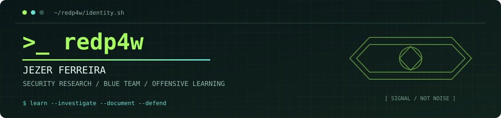

  
   
  
  
  
  

`01 // quem sou`
Tecnólogo em Segurança da Informação. Conecto investigação técnica, automação e governança: esse é meu espaço para compartilhar o que eu vejo e aprendo por ai.
Explorar meus estudos e writeups ↗ · Abrir arquivo técnico ↗
`02 // última atividade` writeups · walkthroughs · estudos
<!-- LATEST:START -->
<table>
<tr><td><code>27.09.2026</code></td><td><a href="https://redp4w.github.io/notes/fragnesia/"><strong>TryHackMe - Fragnesia | Linux Kernel Privilege Escalation</strong></a> TryHackMe · registro técnico publicado no portfólio</td></tr>
</table>
<!-- LATEST:END -->
Sincronizado automaticamente com <a href="https://redp4w.github.io/latest.json">redp4w.github.io/latest.json</a> pelo GitHub Actions. A página mantém o conteúdo completo; aqui aparece somente o índice recente.
`03 // skills` stack de estudo e prática
Sistemas e automação

  &nbsp;
  &nbsp;
  &nbsp;
  &nbsp;
  

Trilhas e fundamentos
`SOC` · `SIEM / análise de logs` · `Incident Response` · `Network Security` · `Windows / AD` · `Linux` · `Web Security` · `OWASP` · `MITRE ATT&CK` · `Wireshark` · `Nmap` · `Python / Shell` · `GRC` · `ISO 27001/27002` · `LGPD`
`04 // certificações & conquistas`

&nbsp;
&nbsp;

&nbsp;

Outros: Inglês B2 (TOEIC). Credenciais verificáveis em Credly.
`05 // plataformas & atividade`
TryHackMe · @probablyacat

Snapshot registrado em 27/09/2026; os números do SVG não são dados em tempo real. Consulte o perfil para o status atual.
Hack The Box · perfil público não vinculado — sem métricas exibidas até confirmação.  
CTFs e laboratórios · registros técnicos e estudos ficam no portfólio.
---

<code>learn → investigate → document → defend</code> <a href="https://redp4w.github.io/">redp4w.github.io</a> · <a href="https://github.com/redp4w/redp4w.github.io">código-fonte e publicações</a>

