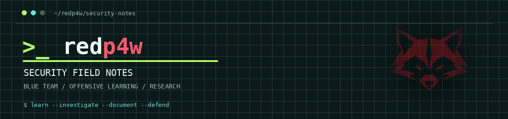
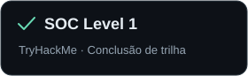
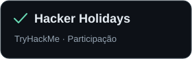
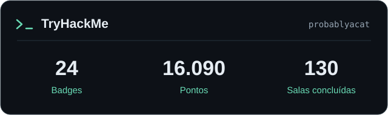

  
    
  <a href="https://redp4w.github.io/">Portfólio</a> &nbsp;·&nbsp;
  <a href="https://tryhackme.com/p/probablyacat">TryHackMe</a> &nbsp;·&nbsp;
  <a href="https://www.credly.com/users/jeh-ferreira">Certificações</a>

## Quem sou

Tecnologo em segurança da informação, entusiasta da tecnologia. Esse é meu espaço pra compartilhar meus estudos, writeups e walktroughs que faço por ai.

## Últimas publicações

<!-- LATEST:START -->
<table>
<tr><td><code>27.09.2026</code></td><td><a href="https://redp4w.github.io/notes/fragnesia/"><strong>TryHackMe - Fragnesia | Linux Kernel Privilege Escalation</strong></a> TryHackMe · publicação no portfólio</td></tr>
</table>
<!-- LATEST:END -->

[Ver todas as publicações ↗](https://redp4w.github.io/arquivo/)

## Skills

<!-- SKILLS: copie uma linha  para acrescentar um ícone. Os SVGs estão em assets/. -->
**Sistemas e automação**

  &nbsp;
  &nbsp;
  &nbsp;
  &nbsp;
  

<!-- SKILLS: adicione termos na linha abaixo, separados por ponto mediano. -->
**Segurança e pesquisa**

SOC · SIEM · Log Analysis · Incident Response · Windows / Active Directory · Linux · Network Security · Web Security · OWASP · MITRE ATT&CK · Wireshark · Nmap · Python / Shell · GRC · ISO 27001/27002 · LGPD

## Certificados

<!-- CERTIFICADOS / Credly: duplique um <a>...</a>, alterando endereço, imagem e descrição. -->

  &nbsp;
  &nbsp;
  

<!-- CERTIFICADOS / TryHackMe: duplique o link, indicando o PDF e o SVG correspondente. -->

  &nbsp;
  

## TryHackMe

Dados de 27/09/2026. [Ver perfil atualizado ↗](https://tryhackme.com/p/probablyacat)

<!-- PLATAFORMAS: inclua aqui um link do Hack The Box quando o perfil público estiver disponível. -->
